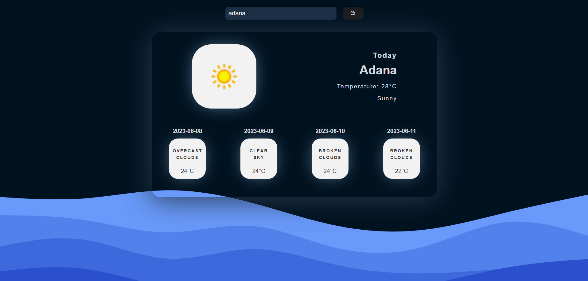

# Weather App

This project is a weather application built using React, TypeScript, and Vite. It displays the current weather and the weather forecast for the next 4 days. The weather data is obtained from 2 different APIs.

## Project Overview

The Weather App is a web application that allows users to check the weather conditions for their location. It provides accurate and up-to-date weather information using the data retrieved from the APIs.
Due to the limitations of the second API used in the project, images representing the weather conditions are not available. Instead, descriptive text is used to indicate the weather conditions.

## Built With

- [React](https://reactjs.org)
- [Typescript](https://www.typescriptlang.org/)
- [React Hot Toast](https://github.com/timolins/react-hot-toast)
- [React Icons](https://react-icons.github.io/react-icons/)
- [Axios](https://axios-http.com/)

## Acknowledgements

- The weather data is provided by [OpenWeatherMap](https://openweathermap.org/api) and [WeatherApi](https://www.weatherapi.com/).
- Special thanks to the creators of the libraries used in this project.

## Demo

- [Link](https://648d09f5cc1ae5322316a12e--unrivaled-cactus-3ec579.netlify.app/)

## Screenshots

